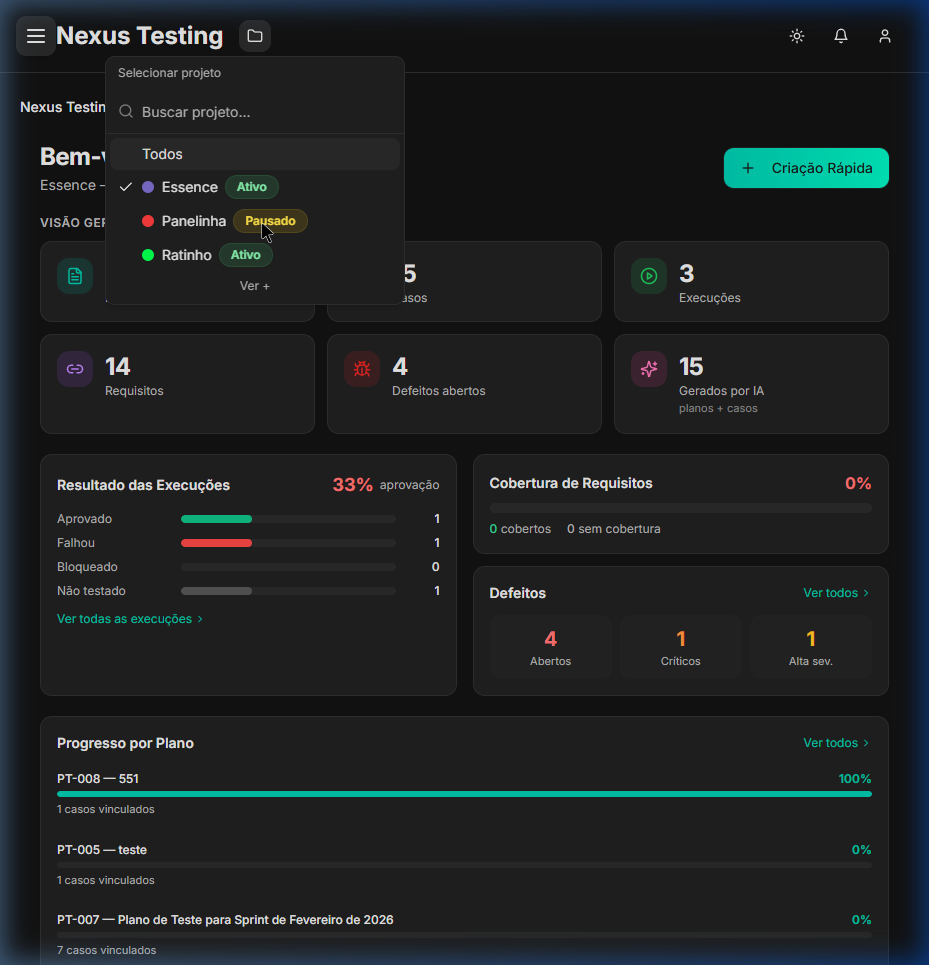
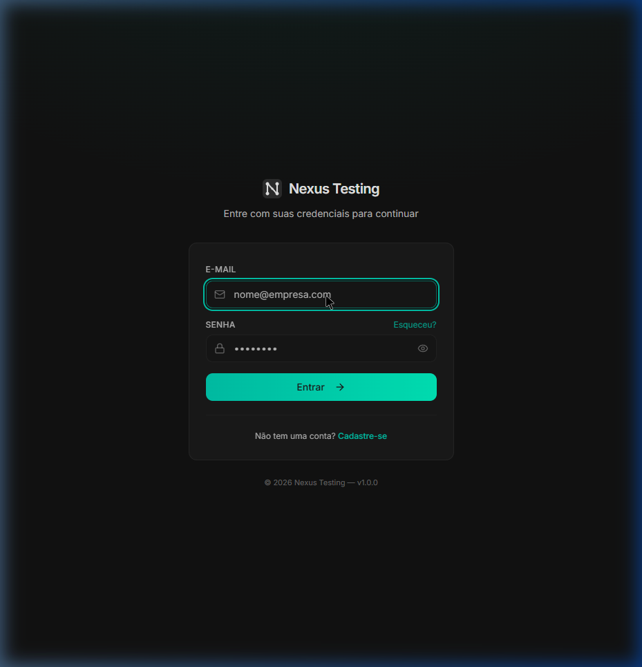
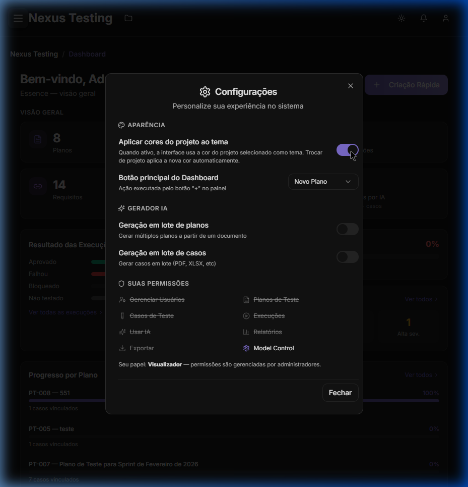
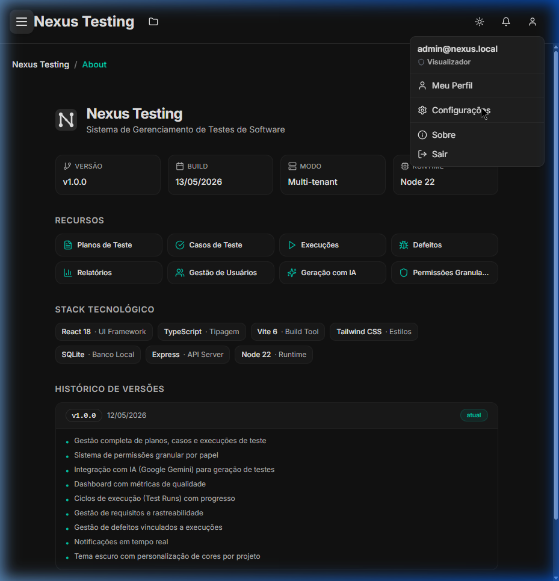

# 🚀 Nexus Testing — Gestão de Testes Minimalista & Eficiente

Fala! Este é o **Nexus Testing**, um projeto que desenvolvi para resolver um problema clássico no fluxo de desenvolvimento: a gestão e execução de testes de software sem a lentidão e a poluição visual de ferramentas corporativas pesadas (como TestLink ou Jira/Zephyr).

A ideia aqui é ter um controle de qualidade extremamente ágil, com um visual escuro (dark mode), minimalista e com suporte a IA nativa para acelerar o planejamento.



---

## 🎨 O Conceito: Estética Premium & Foco
O design foi pensado para reduzir a fadiga de quem trabalha no dia a dia com QA.
* **Interface Flat & Minimalista**: Cores harmoniosas (tons de cinza profundo e acentos em turquesa), tipografia limpa (Inter) e muito espaçamento.
* **Sem placeholders ou poluição**: O fluxo visual foi projetado para levar você direto ao ponto (projetos, planos de teste, execuções e defeitos).

---

## 📸 Imagens Reais do Sistema

### 🔐 Acesso Simplificado
Interface de login minimalista, direta e com proteção contra brute force.


### 📊 Dashboard Consolidado
Indicadores operacionais de projetos, progresso dos planos de teste e distribuição de defeitos gerados dinamicamente em uma única requisição.


### ⚙️ Configurações Customizáveis
Gerenciamento de permissões, perfis, chaves de criptografia e chaves da IA do Google Gemini.


### ℹ️ Sobre o Sistema
Arquitetura interna transparente, listando as tecnologias e logs de versão.


---

## 🛠️ Stack Tecnológica & Arquitetura

O sistema roda localmente de forma extremamente leve:
* **Frontend**: React 18 + Vite 6 + Tailwind CSS (com navegação dinâmica e modais otimizados)
* **Backend**: Node.js + Express (com arquitetura limpa de controle e rotas)
* **Banco de Dados**: SQLite local gerenciado de forma nativa (`better-sqlite3`), utilizando uma camada adaptadora (**Supabase Facade Pattern**) que converte dinamicamente dialeto PostgreSQL para SQLite
* **Segurança Hardened**:
  * **RBAC & Proteção contra IDOR**: Validação estrita de escopo nas mutações para que usuários com papéis limitados (como *Viewer*) não façam alterações não autorizadas.
  * **Sanitização de Dados**: Redação de informações críticas (como hashes de senhas bcrypt) nas respostas de API.
  * **Criptografia Simétrica**: Chaves de API de terceiros armazenadas de forma segura com criptografia AES-256-GCM em repouso.
  * **Rate Limiting**: Bloqueio ativo de tentativas abusivas de login.
* **Performance**: Rotas agregadas otimizadas (resolvendo problemas clássicos de consultas N+1 de banco) para carregar telas complexas em menos de 250ms.
* **Inteligência Artificial**: Integração nativa com a API do **Google Gemini** para criar cenários de teste e automatizar escrita de passos.

---

## 🚀 Como Rodar o Nexus

### Pré-requisitos
* Node.js **v22.20.0** ou superior
* NPM ou Yarn

### Instalação e Inicialização

1. **Clone o repositório**:
   ```bash
   git clone https://github.com/PaulNasc/Nexus-testing.git
   cd Nexus-testing
   ```

2. **Instale as dependências**:
   ```bash
   npm install
   ```

3. **Configure as Variáveis de Ambiente**:
   Crie um arquivo `.env` na raiz do projeto usando o `.env.example` como base:
   ```bash
   cp .env.example .env
   ```
   Adicione as chaves necessárias (como `LOCAL_AUTH_SECRET` e sua `GEMINI_API_KEY`).

4. **Inicialize o Banco de Dados Local (SQLite)**:
   ```bash
   npm run db:bootstrap
   ```
   *Nota: Esse comando criará as tabelas e o usuário master padrão (`paulo.santos@teste` com a senha configurada).*

5. **Inicie o Servidor e o Frontend juntos**:
   ```bash
   npm run dev:all
   ```

---

<p align="center">
  Desenvolvido com dedicação para simplificar a engenharia de qualidade. 🚀
</p>
