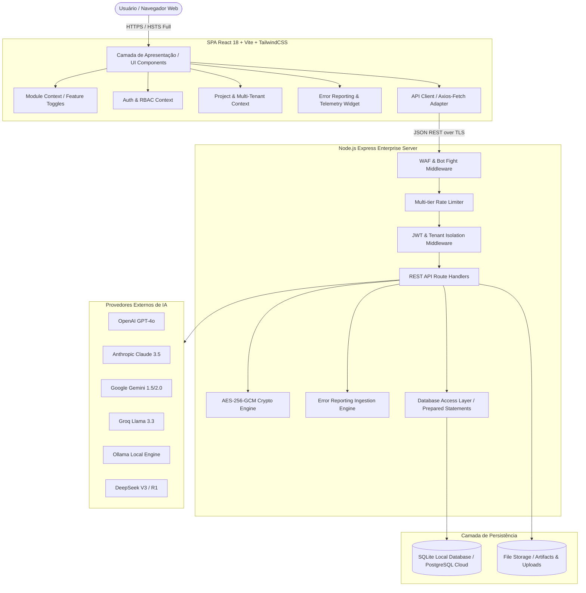

# 🏛️ Architecture & System Design Document — Nexus TCMS

**Sistema:** Nexus Testing & Quality Management System  
**Padrão Arquitetural:** Modular Clean Monolith com Camada de API RESTful e SPA Reativa  
**Data:** 2026-08-22  
**Status:** Produção / Enterprise  

---

## 1. Visão Arquitetural Geral (C4 Model)

---

## 2. Topologia de Camadas e Separação de Responsabilidades

### 2.1 Camada Frontend (`src/`)
- **`components/`**: Componentes reutilizáveis atômicos (Radix UI, Tailwind tokens, Lucide icons, `StandardButton`, `StatusDot`, `UserAvatar`, `GlobalErrorBoundary`).
- **`pages/`**: Páginas funcionais por domínio (`Dashboard`, `TestPlans`, `TestCases`, `TestExecutions`, `TestRuns`, `Gestao`, `Reports`, `ProjectAdmin`, `UserManagement`, `ModelControlPanel`, `History`).
- **`contexts/`**: Provedores de estado global (`AuthContext`, `ProjectContext`, `ModuleContext`, `ThemeContext`).
- **`services/`**: Serviços de comunicação com o backend e provedores de IA (`apiClientService`, `projectService`, `modelControlService`, `apiKeysService`).
- **`types/`**: Definições estritas de tipos TypeScript para todas as entidades e contratos de API.

### 2.2 Camada Backend (`server/`)
- **`server/index.js`**: Ponto central de inicialização Express, registro de rotas REST, middlewares globais de segurança e tratamento de erros.
- **`server/lib/waf.js`**: Firewall de aplicação web em memória com detecção de injeção de SQL, tags XSS maliciosas, path traversal e heurísticas de user-agents maliciosos.
- **`server/lib/crypto.js`**: Motor de criptografia autenticada simétrica `AES-256-GCM` com vetor de inicialização (IV) de 16 bytes e tag de autenticação de 16 bytes.
- **`server/lib/validation.js`**: Validação de esquema e regras de transição de máquinas de estado para Casos, Execuções, Ciclos, Requisitos e Defeitos.
- **`server/db.js`**: Driver `better-sqlite3` com suporte a transações ACID (`BEGIN IMMEDIATE`), modo WAL (Write-Ahead Logging), chaves estrangeiras ativas e consultas preparadas parametrizadas.

---

## 3. Estrutura de Banco de Dados e Isolamento Multi-Tenancy (RLS)

O sistema implementa **Row-Level Security (RLS)** lógico e isolamento estrito de dados garantindo que:
1. Todas as tabelas de entidades de negócio contêm `project_id` e/ou `organization_id`.
2. As queries do backend validam a pertença do usuário ao projeto/organização antes de retornar ou modificar qualquer registro.
3. Não há concatenação de SQL bruto; 100% das consultas utilizam parâmetros nomeados ou posicionais (`?` ou `@param`).

### 3.1 Modelo Entidade-Relacionamento Principal
- **`organizations`**: Tenants do sistema (`id`, `name`, `slug`, `created_at`).
- **`projects`**: Projetos vinculados à organização (`id`, `name`, `slug`, `color`, `status`, `organization_id`, `created_by`).
- **`users` / `profiles`**: Usuários autenticados (`id`, `email`, `display_name`, `role`, `organization_id`).
- **`user_permissions`**: Permissões granulares por usuário (`user_id`, `can_manage_users`, `can_manage_projects`, etc.).
- **`test_plans`**: Planos de teste (`id`, `code`, `title`, `description`, `project_id`, `created_by`).
- **`test_cases`**: Casos de teste vinculados a planos (`id`, `code`, `title`, `steps`, `priority`, `project_id`, `plan_id`).
- **`test_executions`**: Registros de execução de casos (`id`, `code`, `status`, `notes`, `case_id`, `project_id`, `user_id`).
- **`test_runs`**: Ciclos de teste compostos por execuções (`id`, `code`, `name`, `status`, `project_id`).
- **`requirements`**: Requisitos do sistema (`id`, `code`, `title`, `project_id`).
- **`defects`**: Incidentes e defeitos abertos (`id`, `code`, `title`, `severity`, `status`, `project_id`, `case_id`).
- **`error_reports`**: Fila de incidentes com captura de tela, stack trace e console logs (`id`, `error_message`, `stack_trace`, `url`, `screenshot_data`, `user_id`, `project_id`).

---

## 4. Arquitetura Modular & Catálogo de Funcionalidades

O sistema opera com um **Catálogo de Módulos Independentes** que podem ser habilitados/desabilitados:

| Chave do Módulo | Nome Amigável | Dependências | Descrição |
|---|---|---|---|
| `core_testing` | Gestão de Testes Central | Nenhuma | Planos, Casos, Execuções e Ciclos de Teste. |
| `quality_management` | Gestão da Qualidade | `core_testing` | Requisitos, Matriz de Rastreabilidade e Gestão de Defeitos. |
| `ai_assistant` | Assistente de IA | `core_testing` | Geração inteligente de planos/casos e Model Control Panel. |
| `advanced_analytics` | Relatórios e Analytics | `core_testing` | Dashboard executivo e exportações multi-formato. |
| `audit_history` | Histórico e Auditoria | Nenhuma | Logs detalhados de atividades e rastreabilidade de ações. |
| `error_reporting` | Error Reporting & Telemetria | Nenhuma | Botão flutuante de reporte com captura automática de logs e tela. |

---

## 5. Protocolo de Segurança e Defesa em Profundidade

1. **WAF & Rate Limiter:** Filtro antecipado em todas as conexões HTTP.
2. **Strict Headers:**
   - `Strict-Transport-Security: max-age=31536000; includeSubDomains; preload`
   - `X-Content-Type-Options: nosniff`
   - `X-Frame-Options: DENY`
   - `Referrer-Policy: strict-origin-when-cross-origin`
3. **Criptografia Simétrica de Chaves:** Chaves de API externas (ex: OpenAI, Anthropic, Gemini) são criptografadas em repouso no banco e decodificadas apenas no instante do despacho da requisição para o provedor.
4. **Proteção Anti-CSRF & CORS:** CORS configurado para allowlist estrita e headers `Origin` validados.
