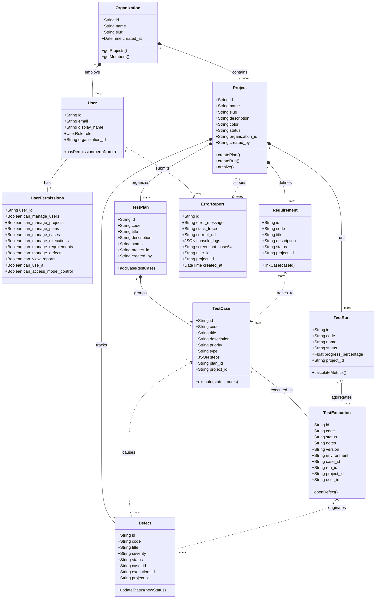
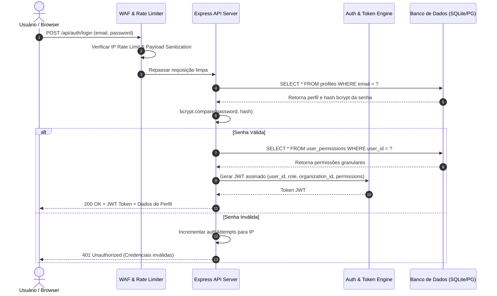
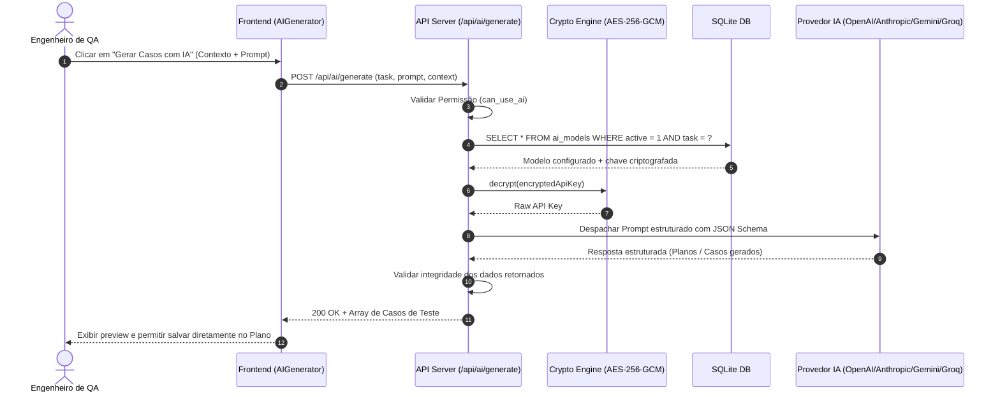
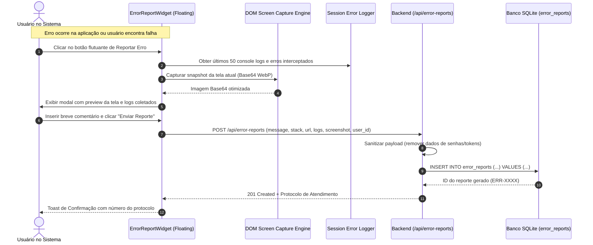
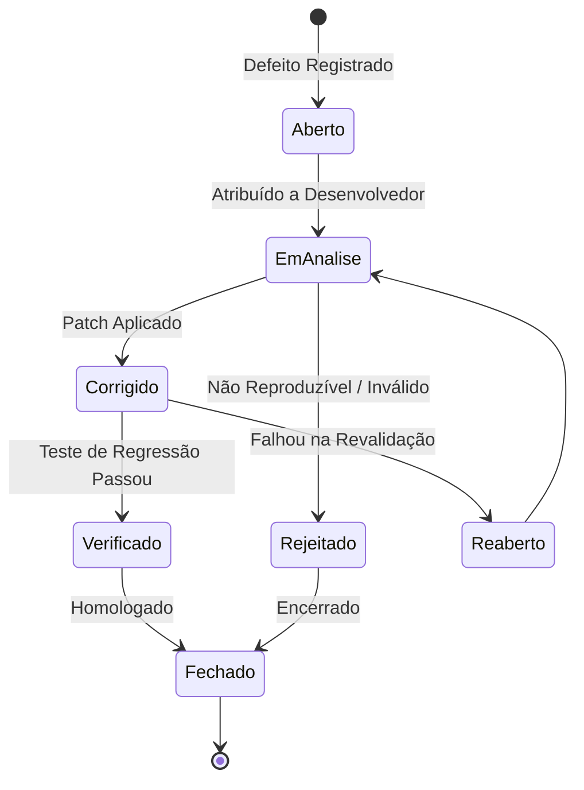

# 📊 Diagramas e Fluxogramas UML do Sistema — Nexus TCMS

**Classificação:** Especificação Técnica de Engenharia  
**Data:** 2026-08-22  
**Formato:** Mermaid UML  

---

## 1. Diagrama de Classes UML (Domínio de Negócio)

---

## 2. Diagrama de Sequência UML: Autenticação, RBAC e Multi-Tenancy

---

## 3. Diagrama de Sequência UML: Geração Assistida por IA (Model Control)

---

## 4. Diagrama de Sequência UML: Error Reporting Automático com Screenshot

---

## 5. Máquina de Estados: Ciclo de Vida de Defeitos e Execuções

